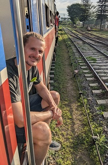

### **Daniel Nowack**
#### Social science researcher at the German Institute of Development and Sustainability (IDOS)

I am a political scientist working on the topics of democratization and autocratization as well as social and cultural change. I am particularly interested in democracy promotion and support which describes how democracy can be protected and nurtured through international (development) cooperation. My research furthermore focuses on how changes in values and attitudes influence democratization and vice versa. 

