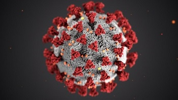
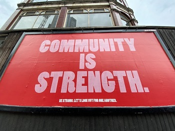

### This is some of my currently ongoing research... 

  

  

  Together with my colleagues [Armin von Schiller](https://www.idos-research.de/armin-von-schiller/) and [Julia Leininger](https://www.idos-research.de/julia-leininger/), I am working on a paper that looks at the Corona pandemic's influence on social cohesion in African societies. 

  I am part of IDOS' [Social Cohesion Team](https://www.idos-research.de/en/research/description/details/social-cohesion-in-africa/). We are working on updating our [data on social cohesion in Africa](https://www.socialcohesion.info/concepts/concept/idos-social-cohesion-concept) and are organizing a workshop on '[Perils and promises: Social cohesion amidst the global polycrisis](https://www.socialcohesion.info/)'. 

  

  

  

  I am currently working on finalizing a network analysis on a collaboration and support network between international democracy promoters and domestic civil society actors during *ad-hoc* reform episodes. 

